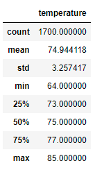
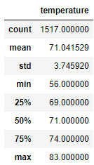

# Surfs-Up
## Summary

The overview of this project is that we are going to do an analysis of temperature trends for our surf shop in Oahu, Hawaii. We are going to utilize data in a SQLite database of Hawaii, and utilize session queries to format date-based temperature measurements into a data frame. Once we create the data frame we are going to describe it in a count, mean, standard deviation, minimum, Max, and quartiles in a table. Once that’s completed, we can compare the June and December temperatures.

## Results

As you can see below these are the two different tables:

### JUNE TEMPS
  

### DECEMBER TEMPS
 

- As we can see between the two, the main temperature between June and December appears to be very similar. There’s only about a 3° difference higher in the summer versus the winter.

- however there is a slightly larger standard deviation of temperature in the winter by a factor of about .5. This means that the temperatures in the winter tend to fluctuate more than the summer.

- Lastly, we can see that the minimum temperatures are off by about 10° from each other, with 64° minimum in the summer and 56° in the winter. However the maximum temperature in the summer and the winter are only off by about 2° where the summer is at a maximum of 85° versus 83° in the winter.

## Summary

Based on the analysis of the data, I would safely assume the temperature in the winter versus the summer is not going to greatly affect my business structure for the surf shop. Ice cream sales will still be somewhat profitable except for there would be a little bit of variability due to the lower temperatures in the winter. However the summer and the winter temperatures remain fairly similar throughout the year. The two queries I would do however would be rain pattern analysis in the summer versus the winter, as well as wind speeds. Rain and wind can drastically affect the ability for a surf shop and an ice cream shop to make sales. If the winter sees higher levels of rain or wind or vice versa for the summer then I would factor those into my sales forecast and how weather would impact my business structure.

